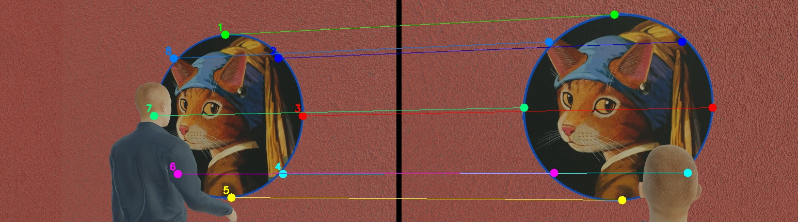
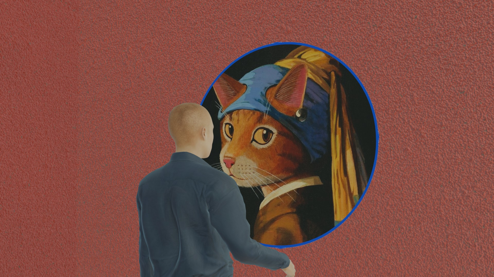
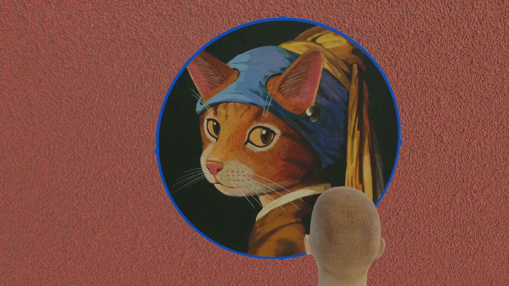
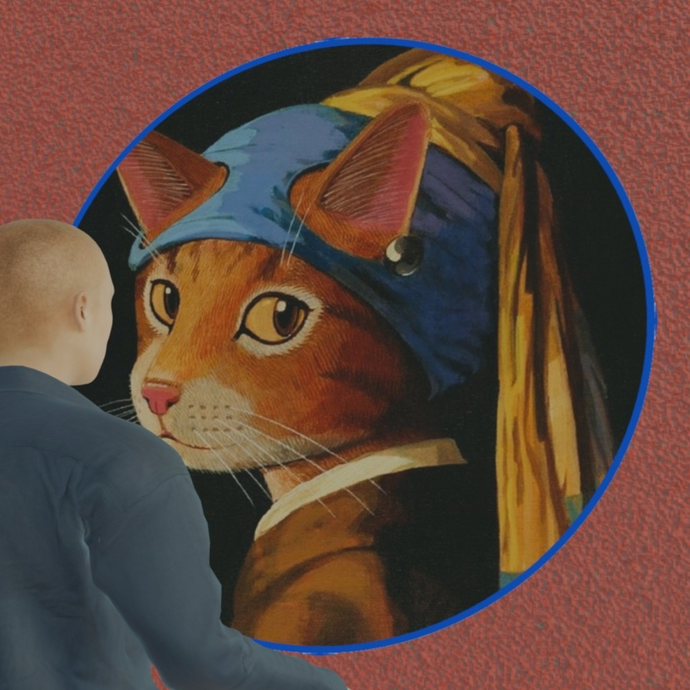
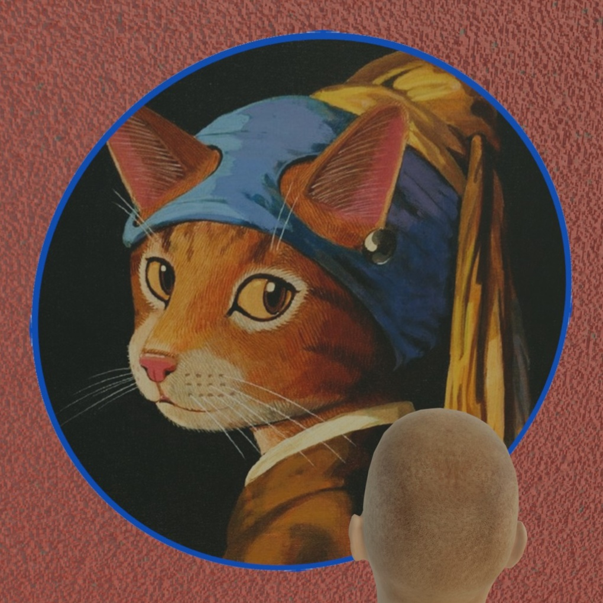
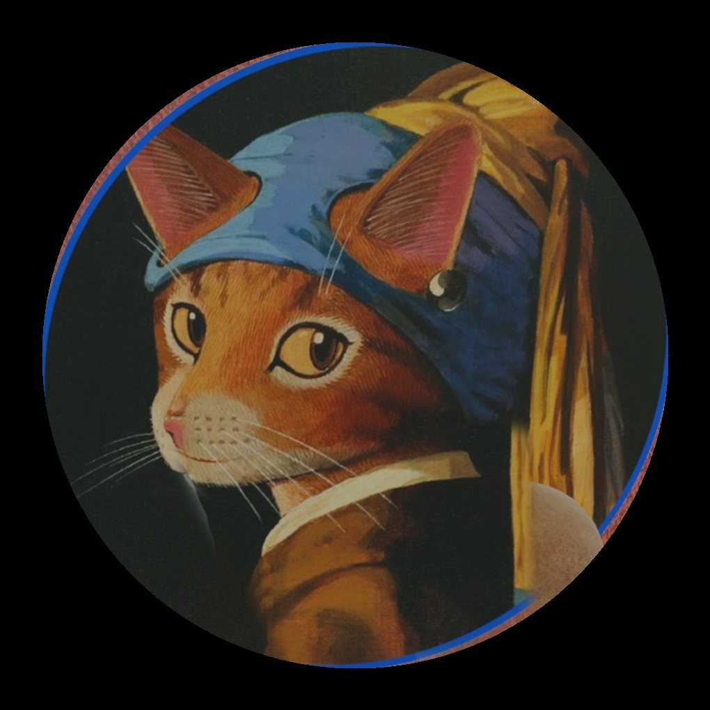
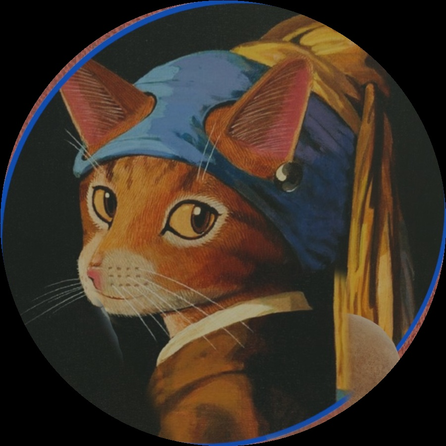

# HW2: Create the Front View of a Circular Painting by Homography

**Course:** Computer Vision and Applications (CI5336701), 2026 Spring, NTUST
**Student ID:** [填入學號]
**Name:** [填入姓名]

---

## Environment

| Item | Version |
|------|---------|
| Python | [填入版本，例如 3.11] |
| OpenCV (`cv2`) | [填入版本，例如 4.11.0] |
| NumPy | [填入版本] |
| OS | [填入作業系統] |

Install dependencies:
```bash
pip install opencv-python numpy
```

---

## How to Run

```bash
python "hw2_template copy.py"
```

Input files (must be in the same folder):
- `1.jpg` — photo of the painting from the right angle
- `2.jpg` — photo of the painting from the left/front angle

Output files generated:
- `[StudentID].jpg` — final result: front view, occlusion-free, cropped to circle
- `warped1.jpg` / `warped2.jpg` — perspective-corrected views of each image
- `merged.jpg` — merged image before final circle crop
- `matches.jpg` — corresponding points marked on both images (side-by-side)

---

## Method Description

### Step 1 — Detect the Circular Frame

The blue circular frame is detected in both images using HSV color segmentation.
The detected contour is filtered by a **circularity score** to pick the most circular
large contour, then `cv2.fitEllipse()` fits an ellipse to it.

> The frame appears as an **ellipse** in each photo due to perspective distortion
> (a circle in 3D projected onto a 2D image plane becomes an ellipse).

### Step 2 — Compute Homography (Ellipse → Canonical Circle)

For each image, **[填入你選取對應點的方式，例如：]**
- 自動從橢圓上等間距取樣 12 個點，對應到正圓上的 12 個點
- / 手動在兩張圖上各選取 [N] 個對應點（說明選哪些特徵點）

The topmost point of each ellipse is used as the parametric start angle,
ensuring that the same physical point on the 3D circular frame maps to the
same position in the canonical (frontal) view for both images.

`cv2.findHomography()` with RANSAC solves for the 3×3 homography matrix **H**
such that: `x_canonical = H · x_image`

### Step 3 — Warp Both Images

`cv2.warpPerspective()` applies **H1** and **H2** to warp both images into
the same canonical frontal-view canvas.

### Step 4 — Merge to Remove Occluding People

**[填入你的合併策略，例如：]**

- `warped2` is used as the base (frontal view is clean except for the bald head at the bottom)
- The person's head in `warped2` is detected by skin-color segmentation (HSV),
  restricted to the lower-center region of the circle to avoid false positives
- A convex hull fills gaps in the detected region
- The head area is replaced with pixels from `warped1` via **feathered alpha blending**
  (Gaussian-blurred mask for seamless edges)

### Step 5 — Crop to Perfect Circle

A circular mask is applied to the merged image and the result is cropped to
a tight bounding box.

---

## Matching Points

The image below shows the [N] corresponding points used on both input images:



**[填入你如何選點的說明，例如：]**
Points were sampled automatically from the detected ellipse perimeter,
starting from the topmost visible point and spaced evenly clockwise.
/ Points were selected manually by identifying [特徵描述，例如：corners of the blue frame,
distinctive painting features, etc.]

---

## Results

| Input 1 | Input 2 |
|---------|---------|
|  |  |

| Warped 1 | Warped 2 |
|----------|----------|
|  |  |

| Merged | Final Result |
|--------|-------------|
|  |  |

---

## Notes / Issues

- [填入任何值得說明的事項，例如遇到的困難、限制、改進方向等]
- Example: The ellipse fit for `1.jpg` is slightly imperfect because the person
  occludes part of the frame.
