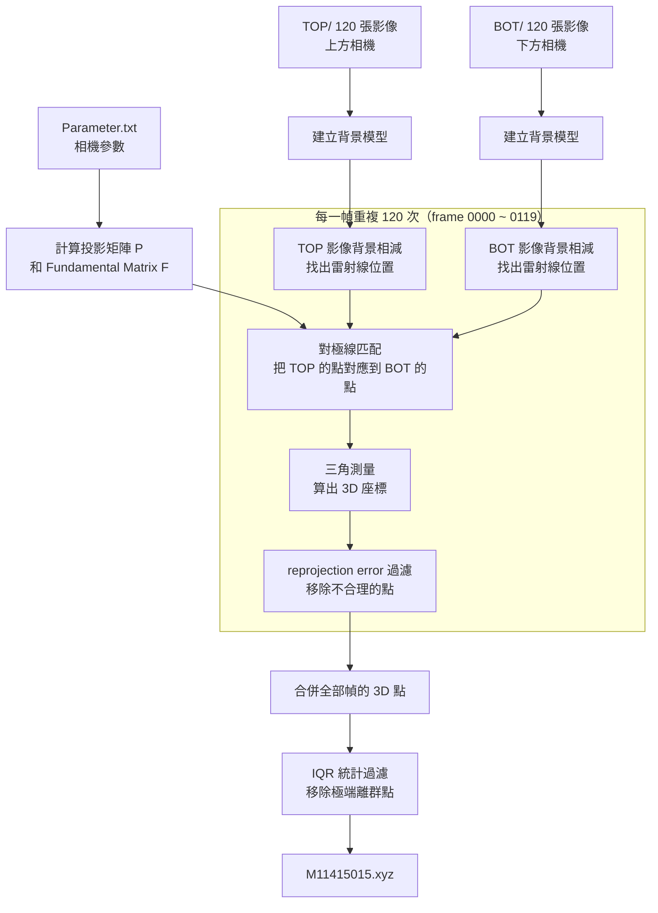

# HW4 — 從兩張影像重建 3D 點雲

## 執行方式

```bash
cd HW4
python reconstruct.py
# 輸出：M11415015.xyz（約 54,000 個 3D 點）
```

---

## 整體流程



---

## TOP 相機和 BOT 相機是什麼？

這個掃描裝置有**兩台相機**，一台裝在上方（TOP），一台裝在下方（BOT），都對著同一個物體（矮人雕像）拍攝。

```
        ┌────────┐
        │ TOP 相機│  ← 從上往下看
        └────────┘
              ↓ ↓ 都看著同一個物體
        ┌────────┐
        │ BOT 相機│  ← 從下往上看
        └────────┘
```

兩台相機**同時拍攝**，所以 `TOP/0042.jpg` 和 `BOT/0042.jpg` 是同一個時間點、同一個雷射位置的畫面，只是視角不同。

---

## 為什麼需要兩台相機？

想像你只閉上一隻眼睛，你很難判斷一個東西離你多遠——你只有 2D 的影像。  
睜開兩隻眼，你就有了**深度感**，因為大腦比較左眼和右眼看到的差異來推算距離。

這個程式做的事情一模一樣：  
用兩台相機看同一個雷射點，比較它在兩張影像上的位置差異，推算出這個點的 **X, Y, Z 真實座標**。

---

## `@` 是什麼？

`@` 在 Python 裡是**矩陣乘法**運算子（不是內積）。

```python
A @ B   # 等同於數學的 A × B（矩陣相乘）
A * B   # 這才是 element-wise，逐元素相乘
```

舉例：相機把 3D 世界座標變成 2D 像素座標，就是用矩陣乘法：

```
像素座標 = P @ 世界座標
(3×1)   = (3×4) @ (4×1)
```

---

## Fundamental Matrix（F）是什麼？

F 是一個 3×3 的矩陣，**描述兩台相機之間的幾何關係**。

它的用途是：如果你知道某個點在 TOP 影像上的位置，F 可以告訴你：「這個點在 BOT 影像上，一定落在這條線上（epipolar line）。」

```
TOP 影像上的一個點 ──F──► BOT 影像上的一條線（epipolar line）
```

這樣找對應點時就不用找整張影像，只需要沿著那條線找，省很多時間也不容易找錯。

---

## 從對極線匹配到 .xyz 的完整說明

### Step 1 — 背景相減，找出雷射線

每一幀影像，雷射線只打在物體的某一個位置。問題是影像裡還有物體本身的顏色、燈光等干擾。

做法：先拍 30 張「平均狀態」的影像，取 median 當背景。再用目前這張影像減掉背景，剩下的就是雷射線的殘影。

```
原始影像 − 背景 = 雷射線殘影
```

接著對每個**直行（column）**，找亮度最高的那個「行（row）」，就是雷射打到的位置。  
為了更精準，用**加權平均**（把周圍幾個 pixel 的亮度當權重）算出比整數更精細的位置，稱為**亞像素（subpixel）精度**。

執行完這步，TOP 和 BOT 各有一組點：

```
TOP 雷射點：[(col=0, row=512.3), (col=1, row=513.1), ...]
BOT 雷射點：[(col=0, row=491.7), (col=1, row=490.2), ...]
```

---

### Step 2 — 對極線匹配

現在我們有 TOP 的雷射點和 BOT 的雷射點，但我們不知道 TOP 的哪個點對應 BOT 的哪個點。

利用 **Fundamental Matrix F**：

```python
lines = (F @ top_h.T).T   # TOP 每個點 → BOT 上的一條對應線
```

對 TOP 的每個點，計算它對應的「對極線」在 BOT 影像上的位置。然後看 BOT 的雷射點裡，哪個點最靠近這條線——距離 < 3 px 就認定是同一個點。

```
TOP 某點 ──F──► BOT 影像上的一條橫線
                    ↓
           找 BOT 雷射點裡最近的那個
```

這樣我們就有了**配對好的點對**：

```
matched_top: [(512, 234.1), (513, 235.3), ...]
matched_bot: [(480, 241.7), (481, 242.0), ...]
```

---

### Step 3 — 三角測量，算出 3D 座標

這是最關鍵的一步。概念很簡單：

想像兩個人站在已知位置，各自用手指向同一個目標。只要知道兩個人的位置，以及各自指的方向（角度），就能算出目標在哪裡。

```
TOP 相機 ●────────────\
                       ✕ ← 這個交點就是 3D 座標
BOT 相機 ●────────────/
```

程式用 `cv2.triangulatePoints` 完成這個計算：

```python
pts4D = cv2.triangulatePoints(P_TOP, P_BOT, matched_top.T, matched_bot.T)
pts3D = (pts4D[:3] / pts4D[3]).T   # 轉換成真實世界座標
```

結果是每個配對點的世界座標 `(X, Y, Z)`。

---

### Step 4 — 過濾不合理的點

三角測量偶爾會算出奇怪的結果（例如相機視線幾乎平行，交點很不穩定）。

**第一關：reprojection error**  
把算好的 3D 點「重新投影」回兩台相機，看看投影回去的位置跟原始觀測到的位置差多少。差超過 2 px 的就丟掉。

```
3D 點 ──P_TOP──► 預測的 2D 位置
                      ↕ 誤差 > 2px → 丟掉
              實際觀測的 2D 位置
```

**第二關：IQR 統計過濾**  
收集完所有 120 幀後，把三個座標軸上的極端值（超過 Q1−3×IQR 或 Q3+3×IQR 的）全部移除。這次移除了 123 個點。

---

### Step 5 — 儲存成 .xyz

```python
np.savetxt('M11415015.xyz', cloud, fmt='%.6f')
```

`.xyz` 就是一個純文字檔，每一行是一個 3D 點的座標：

```
4.802163 -10.615338 90.578407
4.812355 -10.747731 90.642197
...
```

總共 **54,026 行 = 54,026 個 3D 點**，組合起來就是矮人雕像的點雲。

---

## 各函式對照表

| 函式 | 做什麼 | 輸入 → 輸出 |
|---|---|---|
| `compute_fundamental()` | 計算兩相機的幾何關係矩陣 F | K, RT → 3×3 矩陣 |
| `build_background()` | 建立無雷射的背景影像 | 30 張影像 → 背景 |
| `extract_laser()` | 找出雷射線在影像上的位置 | 影像 + 背景 → N 個點 |
| `find_correspondences()` | 配對 TOP 和 BOT 的點 | TOP 點 + BOT 點 + F → 配對點對 |
| `triangulate()` | 算出 3D 座標 | 配對點對 + P 矩陣 → 3D 點 |
| `reject_outliers()` | 移除計算錯誤的點 | 3D 點 → 過濾後的 3D 點 |

---

## 結果

- 輸出：`M11415015.xyz`
- 點數：54,026 點
- 因為雷射從固定方向打，只能掃到物體的**正面**，背面是空的（這是正常現象，不是程式錯誤）
